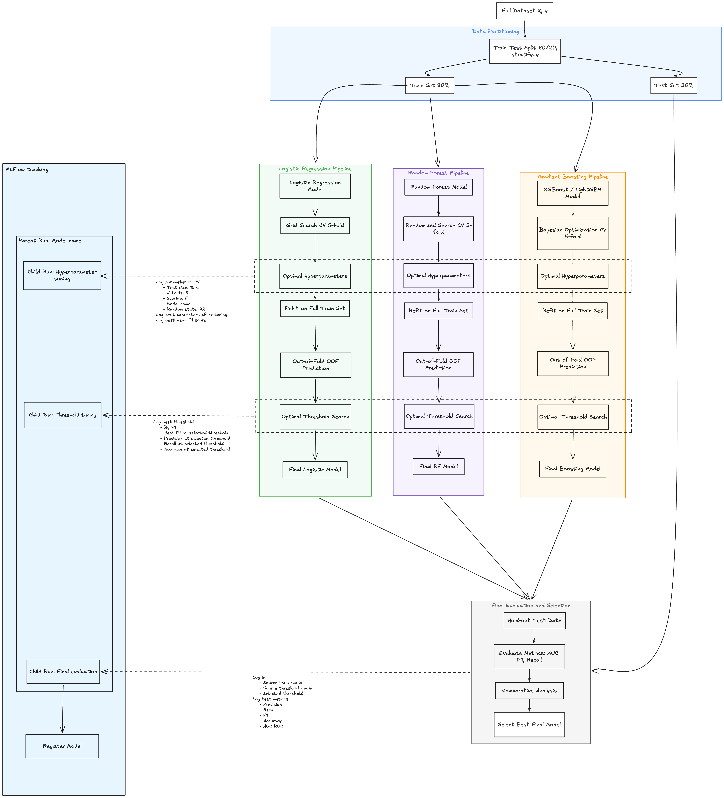

# Home Credit Risk Prediction Pipeline

End-to-end Machine Learning & Data Engineering project for credit default risk prediction using the Home Credit dataset.

This project focuses on building a production-style workflow:

- PostgreSQL Data Warehouse
- dbt Transformation Pipeline
- Feature Engineering
- ML Training Pipeline
- MLflow Experiment Tracking
- Model Evaluation & Selection

---

# Tech Stack

| Category | Tools |
|---|---|
| Language | Python 3.8.17 |
| Database | PostgreSQL |
| Transformation | dbt |
| ML | Scikit-learn (Logistic Regression), XGBoost, LightGBM |
| Experiment Tracking | MLflow |
| Visualization | Matplotlib, Seaborn |
| Environment | Virtual Environment (`venv`) |

---

# Project Structure

```bash
home_credit_risk/
│
├── create_db/
│   ├── create_db.py
│   ├── create_tables.py
│   ├── load_data.py
│   └── db_connection.py
│
├── dbt/
│   ├── models/
│   │   ├── staging/
│   │   ├── intermediate/
│   │   └── marts/
│   │
│   ├── macros/
│   └── schema.yml
│
├── notebooks/
├── src/
├── artifacts/
├── images/
├── requirements.txt
└── README.md
```

---

# Environment Setup

## Python Version

```bash
python --version
```

Expected:

```bash
Python 3.8.17
```

---

## Create Virtual Environment

```bash
python -m venv .venv
```

---

## Activate Environment

```bash
source .venv/bin/activate
```

---

## Install Libraries

```bash
pip install -r requirements.txt
```

---

# Dataset

The project uses the Home Credit Default Risk dataset.

Main CSV files:

- `application_train.csv`
- `application_test.csv`
- `bureau.csv`
- `bureau_balance.csv`
- `previous_application.csv`
- `POS_CASH_balance.csv`
- `credit_card_balance.csv`
- `installments_payments.csv`

---

# Data Warehouse Architecture

Overall pipeline:

```text
Raw Sources → Staging Models → Intermediate Features → Mart Tables
Bronze → Silver → Silver (Feature Engineering) → Gold
```


---

# Data Warehouse Layers

| Layer | Purpose | Output |
|---|---|---|
| Raw | Store original CSV data | Raw tables |
| Staging | Clean & standardize data | Cleaned tables |
| Intermediate | Feature engineering & aggregation | Feature tables |
| Mart | Final dataset for ML training | Customer-level dataset |

---

# Layer Details

| Layer | Input | Models | Key Transformations | Output |
|---|---|---|---|---|
| Raw (Bronze) | CSV files | `raw.*` | Load into PostgreSQL | Raw tables |
| Staging (Silver - Cleaning) | `raw.*` | `stg_*` | Type casting, missing value handling, standardization | Cleaned tables |
| Intermediate (Silver - Feature Engineering) | `stg_*` | `int_*` | Aggregation, behavior features, delinquency signals | Feature tables |
| Mart (Gold) | `int_*` | `mart_application_*` | Join all customer-level features | Final ML dataset |

---

# PostgreSQL Setup

## Test PostgreSQL Connection

```bash
python create_db/db_connection.py
```

Expected output:

```python
('PostgreSQL 18.3 on x86_64-apple-darwin24.6.0 ...')
```

---

## Create Database

```bash
python create_db/create_db.py
```

This script:

- Connects to PostgreSQL
- Creates `home_credit` database

---

## Create Raw Tables

```bash
python create_db/create_tables.py
```

---

## Load CSV Data

```bash
python create_db/load_data.py
```

All CSV files are loaded into PostgreSQL raw tables.

Important design choice:

- Raw layer stores data exactly as received
- Most columns are initially loaded as `TEXT`

This preserves source integrity before transformation.

---

# dbt Setup

## Initialize dbt Project

```bash
dbt init
```

Select:

```text
Database: postgres
```

---

## Configure profiles.yml

Location:

```bash
~/.dbt/profiles.yml
```

Used to connect dbt to PostgreSQL.

---

## Configure dbt_project.yml

```yaml
models:
  home_credit_risk:
    # Config indicated by + and applies to all files under models/example/
    staging:
      +materialized: view

    intermediate:
      +materialized: view
      +schema: int
    
    mart:
      +materialized: table
      +schema: marts

```

---

# Staging Layer

Main responsibilities:

- Cast columns from `TEXT` to correct data types
- Standardize missing values
- Rename inconsistent columns
- Improve readability and consistency

Examples:

| Original Type | Converted Type |
|---|---|
| IDs | integer / bigint |
| Numeric values | numeric / double precision |
| Flags | boolean / smallint |
| Categories | text / varchar |

---

# Intermediate Layer

Feature engineering and aggregation layer.

Main tasks:

- Aggregate historical records
- Generate customer-level behavioral signals
- Convert:
  
```text
SK_ID_PREV → SK_ID_CURR
```

Examples:

- Previous application statistics
- Delinquency behavior
- Credit utilization
- Late payment ratios
- Installment behavior

---

# Mart Layer

Final analytical layer.

Main outputs:

- `mart_application_train`
- `mart_application_test`

These datasets are used directly for:

- Machine Learning
- Model Evaluation
- Experiment Tracking

---

# dbt Lineage Graph

Generated using:

```bash
dbt docs generate
dbt docs serve
```

Example lineage graph:


---

# Machine Learning Pipeline

The ML pipeline includes:

- Logistic Regression
- Random Forest
- Gradient Boosting Models
- Hyperparameter Tuning
- Threshold Optimization
- Final Model Selection

---

# Experiment Flow



---

# MLflow Tracking

MLflow is used to track:

- Hyperparameters
- Metrics
- Threshold tuning
- Model comparison
- Final model registration

Tracked metrics:

- AUC ROC
- F1 Score
- Precision
- Recall
- Accuracy

---

# Data Versioning with DVC

The project uses DVC (Data Version Control) to version processed datasets and ensure reproducibility across experiments.

Current usage:

- Track processed datasets
- Store dataset versions separately from Git
- Enable reproducible ML experiments
- Support future dataset evolution and feature engineering changes

Typical workflow:

```bash
dvc init

dvc add data/processed/train_v1.parquet

git add .gitignore *.dvc
git commit -m "Track processed datasets with DVC"
```

```text
data/
├── raw/
├── processed/
│   ├── train_v1.parquet
│   ├── train_v1.parquet.dvc
```
---
# ML Workflow

- Logistic Regression
- XGBoosts
- LightGBM

## Train/Test Split

```python
train_test_split(
    X,
    y,
    test_size=0.2,
    stratify=y,
    random_state=42
)
```

---

## Hyperparameter Tuning

- Grid Search CV
- Randomized Search CV

---

## Threshold Optimization

Instead of using default threshold `0.5`, the project searches for the best threshold based on:

- F1 Score
- Recall
- Precision
- AUC
- Accuracy

---
# Model Selection Summary

Three models were evaluated for the Home Credit default prediction task: Logistic Regression, XGBoost, and LightGBM.

| Model | Accuracy | Precision | Recall | F1 Score | AUC |
|---|---:|---:|---:|---:|---:|
| Logistic Regression | 0.8503 | 0.2470 | 0.4363 | 0.3154 | 0.7605 |
| XGBoost | 0.8516 | 0.2574 | 0.4532 | 0.3283 | 0.7705 |
| LightGBM | 0.8516 | 0.2562 | 0.4405 | 0.3240 | 0.7710 |

Although all three models achieved similar accuracy, accuracy is not the most important metric in this problem because the dataset is highly imbalanced. The main focus is identifying default customers, represented by class `1`.

XGBoost achieved the best overall performance on the minority class. It produced the highest precision, recall, and F1 score among the three models. This means XGBoost was better at detecting default cases while maintaining a reasonable balance between false positives and false negatives.

LightGBM achieved the highest AUC, which indicates strong ranking ability. However, its F1 score and recall were slightly lower than XGBoost. Logistic Regression performed well as a baseline model, but it was limited by its linear assumptions and showed weaker minority-class performance compared to the boosting models.

Based on the evaluation results, XGBoost is selected as the final model for deployment. It provides the best trade-off between recall, precision, and F1 score, which is more suitable for credit default risk prediction than accuracy alone.

---

# Model Deployment

The selected XGBoost model was deployed using FastAPI and MLflow to simulate a lightweight production inference service.

Deployment pipeline:

```text
Raw User Input
        ↓
FastAPI REST API
        ↓
Input Validation (Pydantic)
        ↓
Preprocessing Pipeline
(Encoding + Scaling)
        ↓
XGBoost Model
        ↓
Probability Prediction
        ↓
Threshold Decision
        ↓
JSON Response
```

---

# Deployment Architecture

```text
Client / Browser
        ↓
FastAPI Server (:8000)
        ↓
Predictor Service
        ↓
MLflow Tracking Server (:5002)
        ↓
XGBoost Model Artifact
```

---

# Deployment Structure

```bash
app/
├── main.py
├── predictor.py
├── schemas.py
```

| File | Purpose |
|---|---|
| `main.py` | FastAPI application entry point |
| `predictor.py` | Model loading, preprocessing, prediction |
| `schemas.py` | Request & response validation |

---

# MLflow Model Serving

The trained XGBoost model is loaded directly from MLflow artifacts:

```python
mlflow.xgboost.load_model(
    MODEL_URI
)
```

MLflow tracking server:

```bash
mlflow server \
--host 127.0.0.1 \
--port 5002
```

---

# FastAPI Server

Start API server:

```bash
uvicorn app.main:app \
--host 0.0.0.0 \
--port 8000 \
--reload
```

Swagger UI:

```text
http://127.0.0.1:8000/docs
```

---

# Preprocessing Artifacts

The deployment pipeline reuses preprocessing artifacts generated during training:

```text
artifact/preprocessing/
├── ohe.pkl
├── scaler.pkl
├── categorical_cols.pkl
├── numerical_cols.pkl
└── feature_columns.pkl
```

These artifacts ensure consistency between:

- Training pipeline
- Inference pipeline

---

# Prediction Flow

The deployed API performs:

1. Receive raw customer data
2. Fill missing columns
3. Apply OneHotEncoding
4. Apply StandardScaler
5. Align features with training schema
6. Generate probability prediction
7. Apply optimized threshold
8. Return JSON response

---

# Example API Response

```json
{
  "default_probability": 0.2107,
  "prediction": 0,
  "threshold": 0.6
}
```

Meaning:

- Predicted default probability = 21.07%
- Threshold = 60%
- Final prediction = Non-default customer

---
# Docker Containerization

The inference service was containerized using Docker.

Main deployment steps:

## Build Docker Image

```bash
docker build -t home_credit_risk:v0 .
```

## Run Container

```bash
docker run -p 8000:8000 home_credit_risk:v0
```

---

# Docker Benefits

Containerization provides:

- Environment consistency
- Dependency isolation
- Reproducible deployment
- Portable inference service
- Simplified production deployment
---

# Deployment Goals

The deployment layer demonstrates:

- End-to-end ML workflow
- Model serving architecture
- MLflow integration
- Reusable preprocessing pipeline
- Production-style inference design
- Real-time prediction capability
# Final Outputs

Final outputs of the project:

- Production-style Data Warehouse
- Clean customer-level datasets
- Feature engineering pipeline
- Experiment tracking workflow
- Trained ML models
- Reproducible end-to-end pipeline

---

# Future Improvements

Potential next steps:

- Docker deployment
- FastAPI inference service
- CI/CD pipeline
- Feature Store integration
- Airflow orchestration
- Model monitoring
- Data validation with Great Expectations

---

# Author

Gia Khánh

Focused on:

- Data Engineering
- Machine Learning Engineering
- MLOps
- End-to-End ML Systems
