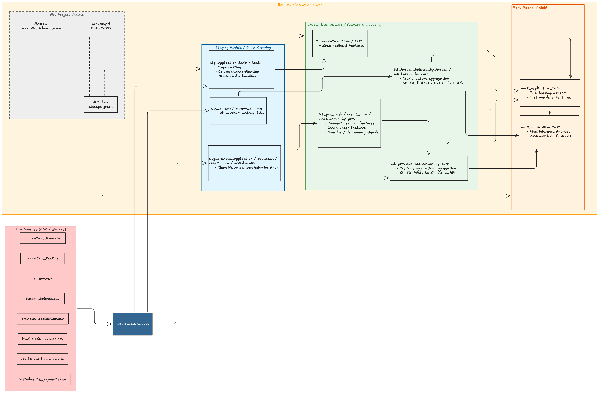
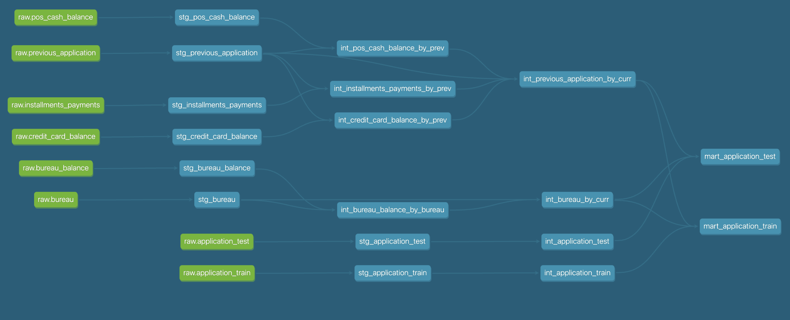

# Overall flow

raw sources → staging models → intermediate aggregation/features → mart tables
Bronze/raw → Silver/staging → Silver/intermediate → Gold/mart

| Layer | Purpose | Output |
|------|--------|--------|
| Raw | Store original CSV data | Raw tables |
| Staging | Clean & standardize data | Cleaned tables |
| Intermediate | Feature engineering & aggregation | Feature tables |
| Mart | Final dataset for analysis and training | Customer-level dataset |

| Layer                                           | Input                                                      | Models                                                                                                                                                                                                                | Key Transformations                                                                           | Output                   |
| ----------------------------------------------- | ---------------------------------------------------------- | --------------------------------------------------------------------------------------------------------------------------------------------------------------------------------------------------------------------- | --------------------------------------------------------------------------------------------- | ------------------------ |
| **Raw (Bronze)**                                | CSV files (application, bureau, credit, POS, installments) | `raw.*`                                                                                                                                                                                                               | Ingestion into PostgreSQL                                                                     | Raw tables               |
| **Staging (Silver - Cleaning)**                 | `raw.*`                                                    | `stg_application_*`, `stg_bureau`, `stg_previous_application`, `stg_pos_cash_balance`, `stg_credit_card_balance`, `stg_installments_payments`                                                                         | Type casting, missing value handling, column standardization                                  | Cleaned tables           |
| **Intermediate (Silver - Feature Engineering)** | `stg_*`                                                    | `int_application_*`, `int_bureau_balance_by_bureau`, `int_bureau_by_curr`, `int_pos_cash_balance_by_prev`, `int_credit_card_balance_by_prev`, `int_installments_payments_by_prev`, `int_previous_application_by_curr` | Aggregation (SK_ID_PREV → SK_ID_CURR), behavioral features, credit usage, delinquency signals | Feature tables           |
| **Mart (Gold)**                                 | `int_*`                                                    | `mart_application_train`, `mart_application_test`                                                                                                                                                                     | Join all features into customer-level dataset                                                 | Final dataset |

# DBT docs serves 
